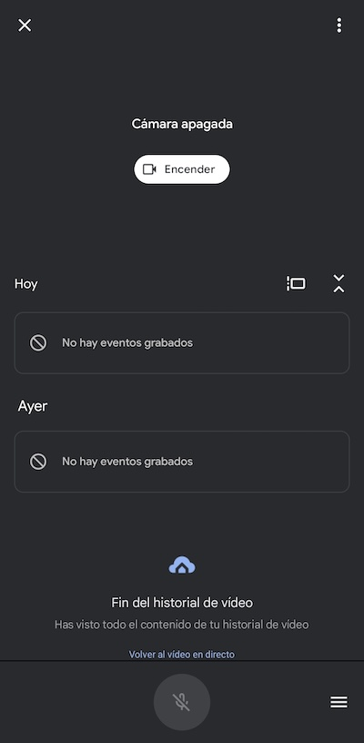
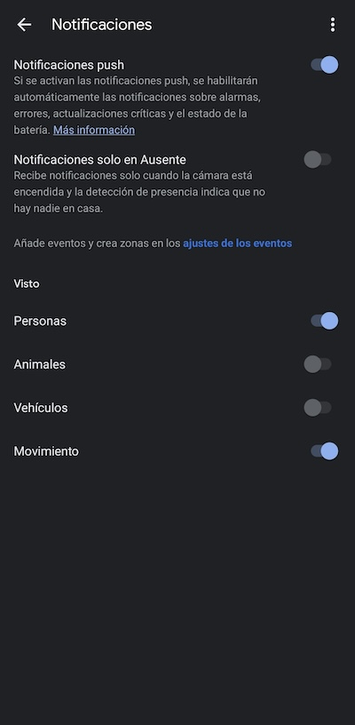
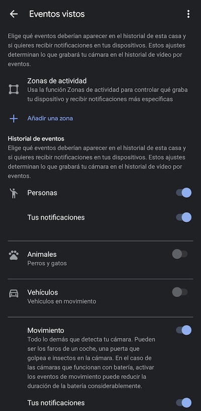
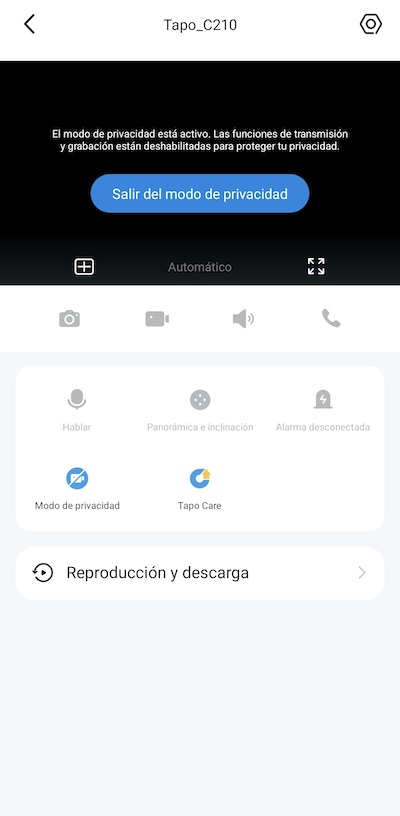
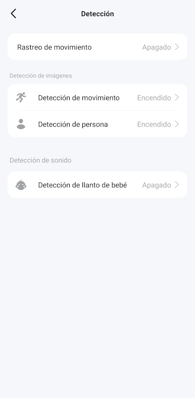
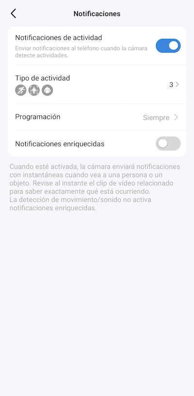
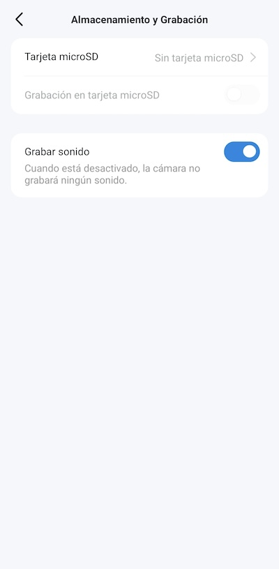
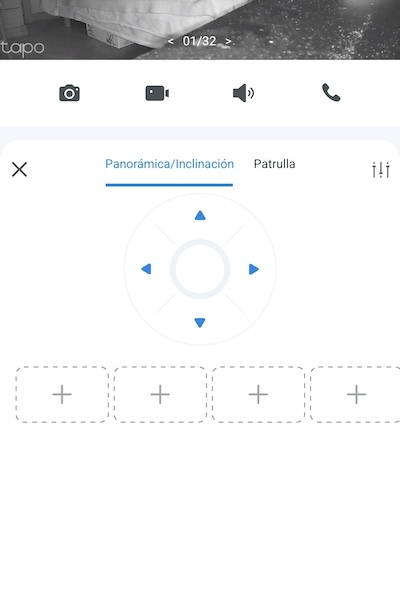

### Índice

1. [Enunciado](#1)
2. [Introducción](#2)
3. [Análisis de la vulnerabilidad](#3)
4. [Tres escenarios sobre la vulnerabilidad](#4)
5. [Escenario simulado](#5)

### 1. Enunciado  ###

**Contexto práctico**

Debes realizar un trabajo individual sobre una de las vulnerabilidades recogidas por la OWASP, que te asignará el profesor (**Fallos en el registro y Monitoreo**). Pueden ser tanto vulnerabilidades web como vulnerabilidades móvil.

El trabajo debe constar de un índice, una introducción, un análisis de la vulnerabilidad, un apartado donde expliques 3 situaciones donde se pueda dar y un escenario donde pongas en práctica una de las situaciones, de manera práctica, realista y simulada. Por un lado, debes documentarte y analizar la vulnerabilidad. Una vez realizado esto, debes reproducir la vulnerabilidad asignada de forma que se perciba cómo esta afecta, qué es lo que la caracteriza y, para finalizar, como se puede solventar desde tu punto de vista.

Para esta entrega puedes realizar un trabajo escrito para la parte teórica y luego realizar un video mostrando la vulnerabilidad, reproduciéndola en tu equipo. En caso de no realizar un video mostrándola, debes documentar paso a paso y haciendo evidente qué quieres mostrar, de una situación de la vulnerabilidad asignada.

**¿Qué se pide?**

1. Realizar un trabajo en formáto ánalisis de la vulnerabilidad. Debe contener mínimo: índice, introducción, análisis de la vulnerabilidad, 3 escenarios actuales y realistas donde suceda o pueda suceder.
2. Entregar una reproducción, integrándola en el markdown (.md), ya sea en formato video o documentación, donde reproduzcas un escenario en tu propio equipo/nube/vm/contenedor donde se dá la vulnerabilidad.

[Subir arriba](#indice)

### 2. Introducción  ###

Dentro de los recursos que tienen los profesionales de la informática y las empresas para fortalecer la seguridad informática, existe uno que se ha convertido en crucial para el sector, el **Top 10 de vulnerabilidades y fallos de seguridad** más críticos del momento. Esta publicación de la **OWASP** (Open Web Application Security Proyect) aprovecha el potencial de las fuentes abiertas para evaluar distintos parámetros como vulnerabilidades, ataques conocidos, impactos y manejo de datos, y gracias a ello poder hacer la clasificación de las vulnerabilidades web. La importancia de este Top10 no solo radica en servir de guía para identificar y mitigar riesgos, también juega un papel educativo y de sensibilización importante al destacar mejores prácticas de seguridad en el desarrollo del software.

Además de una lista de problemas de seguridad, el Top10 de OWASP también es un reflejo de hacia a dónde avanza el mundo de la seguridad informática. Cada punto de la lista es resultado de una profunda compilación y análisis de datos, junto con contribuciones de muchos expertos en seguridad y consultas a la comunidad de desarrolladores que hacen de esta lista un termómetro de los desafíos del sector.

En este trabajo nos centraremos en uno de los puntos de la lista, concretamente el que está en novena posición, **Fallos en el registro y monitoreo**. Haremos un análisis de esta vulnerabilidad, estudiando posibles escenarios. 

[Subir arriba](#indice)

### 3. Análisis de la vulnerabilidad  ###

**Fallos en el registro y monitoreo** ocupa actualmente la novena posición del Top10 de OWASP. Hace referencia a la insuficiencia o ineficacia de los mecanismos de registro y monitoreo de las aplicaciones, lo que puede provocar que no se detecten ataques o brechas de seguridad. Es una vulnerabilidad crítica, porque un sistema robusto que analice y monitorice la seguridad es esencial para poder detectar y responder ante ataques. 

Las herramientas de registro y monitoreo nos ayudan a identificar patrones inusuales sospechosos, señales de que se puede estar produciendo un ataque o una brecha de seguridad. Son importantes porque sin ellas será muy difícil detectar el peligro, y mucho menos hacerle frente. No saber qué parte del sistema es vulnerable para arreglarla por desconocer incluso que ha habido un ataque por esa parte.

_Cuando un ladrón entra en una casa, tiene primero que pisar el césped, abrir una ventana, desplazarse por la casa, perder tiempo examinando lo que se puede llevar, salir, etc. En todo ese proceso puede hacer ruido, dejar huellas de barro o cosas movidas de sitio, señales de que algo no va bien, pero seríamos incapaces de detectar todo eso si nadie comprueba el estado del césped, ni si las ventanas están correctamente cerradas, ni hace un inventario de las cosas que tiene junto con la comprobación de que las tiene todas. Si nadie tampoco observa las huellas de barro para determinar por qué ventana entraron, ni se para a analizar por qué hay un hueco donde antes había algo, el ladrón podría volver a repetir su hazaña todas las veces que quisiese porque nadie tendría forma de darse cuenta, **sería una casa muy vulnerable**, aunque contase con todo tipo de armas para hacer frente a un potencial ladrón._

Las consecuencias de esta vulnerabilidad son bastante importantes, se tarda más tiempo en detectar una brecha de seguridad, si es que se detecta, habiendo también imposibilidad de hacer un seguimiento adecuado a las señales sospechosas. Derivado de esto estaría la incapacidad de encontrar puntos vulnerables en el sistema al no poder realizar de forma adecuada una auditoría, se estaría expuesto a brechas de seguridad no detectadas. Por último estaría el apartado de la normativa, donde seguro se incumpliría en muchos casos, lo que podría conllevar multas si por ejemplo se vulnera la protección de datos.

En cualquier momento pueden suceder eventos auditables, como inicios de sesión o transacciones de alto valor que tienen que ser registradas. Las advertencias y los errores tienen que generar registros claros y adecuados para identificar qué está fallando, y tienen que ser monitoreados para detectar actividades sospechosas. Los umbrales de alerta deben estar bien implementados para que sean útiles, que avisen correctamente a la hora de hacer un análisis de penetración.

Para solventar esta vulnerabilidad se pueden aplicar buenas prácticas, como por ejemplo implementar un sistema de registro, configurarlo adecuadamente, utilizar herramientas automatizadas para el análisis de registos y hacer pruebas periódicas y auditorías del sistema de monitoreo.

La propia OWASP publica una serie de controles que deben implementar los desarrolladores para prevenir este problema.

> - Asegúrese de que todos los errores de inicio de sesión, de control de acceso y de validación de entradas de datos del lado del servidor se pueden registrar con suficiente contexto como para identificar cuentas sospechosas o maliciosas y mantenerlo durante el tiempo suficiente para permitir un posterior análisis forense.
> - Asegúrese de que los registros se generen en un formato fácil de procesar por las herramientas de gestión de registros.
> - Asegúrese de que los datos de registros son correctamente codificados para prevenir inyecciones o ataques en el sistema de monitoreo o registros.
> - Asegúrese de que las transacciones de alto valor poseen una traza de auditoria con controles de integridad para evitar la modificación o el borrado, tales como permitir únicamente la inserción en las tablas de base de datos o similares.
> - Los equipos de DevSecOps debe establecer alertas y monitoreo efectivo tal que se detecte actividades sospechosas y responderlas rápidamente.
> - Establezca o adopte un plan de respuesta y recuperación, tal como NIST 800-61r2 o posterior.

Sería también útil considerar la capacitación de los empleados en la identificación de patrones sospechosos, y generar un buen sistema de políticas claras sobre la manipulación de los registros. Una correcta implementación de un sistema eficaz de registro y monitoreo es fundamental para proteger los recursos de una organización al permitir detectar y dar respuesta adecuada a brechas de seguridad.

[Subir arriba](#indice)

### 4. Tres escenarios sobre la vulnerabilidad 

A continuación expondremos tres situaciones donde se reflejará la importancia de esta vulnerabilidad

**Primer escenario**

_A Volandas_ es una agencia de viajes que tiene cuatro empleados: Marcos, el gerente, y tres empleados que trabajan de cara al público, Marta, Jose y Mercedes. Los cuatro acceden con sus ordenadores de sobremesa al servidor, teniendo Marta, Jose y Mercedes acceso limitado, a diferencia de Marcos que tiene permiso de administración. 

Un día Mercedes descubre por accidente las claves de administrador de Marcos, y como tiene dificultades económicas decide aprovechar la oportunidad. Desde su propio ordenador entra con las credenciales de administrador, accede a la base de datos de los empleados y se dobla el sueldo, que se puede automatizar desde la propia base de datos.

Varios meses después Marcos empieza a notar que algo no está bien en las cuentas, los beneficios han caído, llegando a tener pérdidas algún mes, pero no encuentra la causa de ello. Los clientes están repitiendo los mismos números que el año pasado, se están cerrando los mismos contratos de viaje que siempre, pero nota que hay un puñado de dinero que no cuadra. Al final descubre el problema al repasar los gastos: uno de los empleados cobra más de lo que le corresponde.

Marcos sospecha que Mercedes ha sido la que se ha cambiado el sueldo, porque en ningún momento ha preguntado por qué cobraba más dinero, y en su currículum indica que tiene conocimientos de informática suficientes para hacerlo, así que la despide. Mercedes consulta con un sindicato y decide denunciar a Marcos por despido improcedente, exigiendo que le pague lo que le corresponde. Tras un intento de mediación donde no se llega a un acuerdo, se pasa a los tribunales.

Marcos se encuentra totalmente desarmado, porque cuando quiso reunir pruebas contra Mercedes se encontró con una dura realidad: **A Volandas no tenía un sistema de registro y monitoreo en su servidor**, no pudo demostrar que Mercedes entró desde su propio ordenador con la clave de administración y se cambió el sueldo a sí misma porque no quedó registrado, ni el inicio de sesión, ni el equipo desde el que se hizo, ni la hora, absolutamente nada. El valor del sueldo cambió sin saber en qué momento ni quién lo cambió.

La justicia le da la razón a Marta, considera que el despido fue improcedente y obliga a Marcos a pagarle una gran suma que incluye su finiquito y una cuantiosa cantidad por daños y perjuicios derivados del despido. Este dinero se suma al que mes a mes ha ido ganando Mercedes de forma extraordinaria. Todo junto se pueden considerar como las pérdidas ocasionadas por una brecha de seguridad, concretamente por **fallas en el registro y monitoreo**, la novena vulnerabilidad de la lista OWASP 2021.

Si el servidor contase con un sistema adecuado de detección que alertara de situaciones sospechosas, como lo sería el inicio de sesión del administrador desde el ordenador de un empleado, o que al menos dejase registrados todos los movimientos hechos por cada ususario, Marcos tendría armas suficientes para mitigar la brecha de seguridad. Se podría haber dado cuenta del desfalco en las cuentas en el momento en que estas cambiasen de valor de forma extraña, no perdería el dinero de todos esos meses, y podría demostrar quién ha sido y desde dónde, con lo cual tampoco tendría que indemnizar a nadie posteriormente.

**Segundo escenario**

Otra empresa afectada por fallas en el registro y monitoreo fue Amueblados, una empresa de venta de mobiliario doméstico. Una cantidad considerable de personas empezó a notar de forma repentina que tenían cargos no reconocidos en sus tarjetas y cuentas bancarias. Todas estas personas contactaron con sus entidades bancarias para saber qué estaba pasando, los cuales reconocieron que los cargos eran muy extraños y no se correspondían con el patrón habitual de sus clientes, aunque no sabían la razón. Por otra parte, muchas de estas personas empezaron a recibir llamadas de publicidad de forma masiva.

Varias semanas después una conocida empresa de seguridad anunció que estaba circulando por la internet profunda una base de datos de personas que tenía nombres, apellidos, teléfonos y datos bancarios, aunque se desconocía el origen. Tras muchas investigaciones por parte de los afectados, muchos se dieron cuenta de que el origen de sus problemas radicaba en que figuraban en esa base de datos. Poco después se pusieron en contacto por las redes sociales, formando un pequeño grupo de afectados que aparecían en esa base de datos. Fue en ese momento, al compartir quién había hecho qué, cuando se dieron cuenta de la realidad que tenían todos en común: Eran clientes de Amueblados.

Sin esfuerzo fue fácil demostrar que todas las personas de la base de datos habían comprado muebles en esa empresa, se hizo público el origen de la brecha de seguridad y así muchos más afectados pudieron enterarse del problema. La pelota ahora estaba en el tejado de la empresa, que por presiones hizo una auditoría de seguridad. La auditoría fue muy desfavorable, dejó claro que la base de datos de clientes coincidía en su totalidad con la que circulaba por internet, pero no hubo forma de encontrar la vulnerabilidad explotada por los atacantes, ni cuándo sucedió el ataque, ni quién lo llevó a cabo **porque el sistema de registro y monitoreo de la empresa estaba desactualizado y muy mal configurado**, no registró ninguno de esos eventos ni los alertó. No fue posible saber si un atacante externo entró en la empresa o si fue un empleado descontento desde dentro el que lo hizo. 

Años antes se habían contratado varios servicios en la nube que redujeron el número de tareas que tenía que hacer el equipo de informática de la empresa, por lo que se decidió prescindir de ellos en su totalidad. El no haber dedicado recursos suficientes en este campo, comprobando el correcto funcionamiento de los sistemas de seguridad, junto con el hecho de haberse publicado a causa de ello la base de datos de los clientes en internet, llevó a la empresa a recibir la mayor multa de su historia, debilitándola mucho económicamente.

En este caso fue una imprudencia dejar sin equipo de seguridad a la empresa, que tras pasar parte de su infraestructura digital a la nube dejó lo activos digitales que aun estaban físicamente dentro de la empresa totalemente desprotegidos. Las medidas de seguridad fueron cambiando, al igual que los ataques, pero estos activos no tenían forma de actualizarse, ni de configurarse correctamente tras cambios. **El sistema de registro y monitoreo que debía detectar ataques y alertar fue totalmente ineficiente porque con el tiempo su configuración quedó obsoleta** y no podía registrar los eventos, entre ellos los ataques y la posterior extracción de la base de datos.

**Tercer escenario** 

El tercer ejemplo ocurre con Pirotecnias Bombón, una empresa especializada en material pirotécnico que cuenta con dos edificios, uno de oficinas y el otro el almacén. Los productos pirotécnicos son muy delicados y por eso necesitan unos controles muy fuertes antes de ser lanzados al mercado. El problema de esta historia empezó cuando la empresa recibe varias reclamaciones porque sus productos son defectuosos. Particulares y empresas que utilizan productos pirotécnicos que no se detonan, o lo hacen mal, provocando daños inesperados. 

Los afectados reclaman poniéndose en contacto con la marca que aparece en los envases del producto, Pirotecnias Bombón, llamando al teléfono de atención al cliente. Todos demuestran que los productos son oficiales y han pagado por ellos. Una primera investigación descubre que todos los afectados han comprado los producos pirotécnicos a través de distribuidores no oficiales por un precio muy inferior al estipulado. Además, las referencias de estos productos indican que estos siguen en el almacén. Al investigar qué pasa en el almacén descubren el problema.

El almacén cuenta por la noche con un sistema de vigilancia por cámaras que se activan por movimiento. Una aplicación recibe la notificación por movimiento y almacena en un archivo de video la grabación que hay en ese momento en las cámaras, dejando registrada la hora y la fecha del evento. El problema en este caso fue que varias de esas cámaras no estaban configuradas correctamente en la aplicación, de forma que no notificaban los movimientos a la aplicación y esta no los grababa. La evidencia es que verdaderamente faltan productos en el almacén pero no se sabe cuándo se los llevaron ni quién, porque las personas que entraron de noche a sustraerlos no fueron detectadas. El problema pasó desapercibido porque la aplicación iba registrando eventos de otras cámaras del edificio, haciendo invisible el mal funcionamiento de algunas de ellas, sumado a que los empleados que acudían a buscar los productos y no los encontraban achacaban el problema a un error informático que no habría registrado una venta anterior. Los productos robados por los asaltantes se almacenaron después en malas condiciones, muy diferentes a las que tienen en el almacen, antes de venderse en el mercado negro, por eso presentaron defectos durante su manipulación.

A raíz de esto resultó difícil determinar la magnitud del problema. Fue necesario hacer inventario de todo el almacén para saber cuántos productos faltaban, pero nunca se pudieron calcular las pérdidas por los productos desaparecidos que los propios empleados marcaban como vendidos pensando que no se habían registrado bien las ventas. La última vez que se configuraron las cámaras fue hace seis años, por lo que no se pudo determinar si quedaron mal configuradas desde ese momento o hubo algún fallo posterior que provocó la mala configuración. No se hicieron comprobaciones periódicas de las cámaras ni tampoco se hicieron auditorías generales de seguridad para buscar la detección de estos problemas. Fue una brecha de seguridad provocada por **falla en el registro y monitoreo** en el que unos atacantes lograron robar activos de la empresa sin ser detectados.

La investigación sigue en curso, se intenta descubrir al distribuidor de los productos robados que almacenó de forma defectuosa los productos pirotécnicos y se los vendió a terceros con precios mucho más baratos, pero los afectados están estudiando demandar a Pirotecnias Bombón, considerándolos responsables del desastre por no haber dedicado suficiente atención a la seguridad de la empresa.

[Subir arriba](#indice)

 

### 5. Escenario simulado  ###

Para este ejercicio aprovecharemos el contexto del escenario 3 anterior. Utilizaremos dos cámaras web de marcas diferentes y tras estudiar sus opciones analizaremos el impacto que tiene su buena o mala configuración.

**Nest Cam de Google**

Esta cámara se conecta de forma muy fácil a la red, contando con el apoyo de una aplicación para el teléfono desde la que se puede controlar. El funcionamiento es sencillo, está encendida continuamente registrando todo, en el momento en el que detecta movimiento graba en un video el evento, notificando además a todos los dispositivos.

La cámara tiene varios modos y opciones, por lo que hay que prestar atención a cómo queda configurada para que haga lo que nosotros queramos. Una mala configuración provocaría una falla en el registro y monitorización, al no notificar correctamente los eventos.

Por ejemplo, la cámara tiene posibilidad de desactivarse temporalmente. Si tras una desactivación programada no se vuelve a activar de nuevo, la cámara ya no registraría ningún movimiento, ni grabaría ningún video.

Otro detalle al que prestar atención es el tema de las notificaciones. La aplicación me está avisando correctamente cuando sucede un evento? En caso contrario habría que revisar la configuración, tanto de la aplicación como la del dispositivo que tiene que emitir las notificaciones, en este caso el teléfono, para que no haya ningún conflicto y odo funcione adecuadamente. No tener este apartado bien configurado podría provocar que sucedan eventos, la cámara los registre y grabe pero nosotros no lleguemos a tiempo al desastre porque no hemos sido avisados.

La cámara permite jugar bastante, tiene un sistema que reconoce caras conocidas, animales o coches, evitando que registre por error eventos que no queremos guardar ni ser alertados, como nosotros mismos pasando delante de la cámara. Es importante configurar bien esto, que no quede activado unicamente el paso de los coches, por ejemplo.

**Tp-Link Tappo**

Esta cámara también está pensada para registrar eventos con el movimiento. Tiene muchas opciones, entre las que destaca el movimiento de la propia cámara siguiendo un objetivo en movimiento. Como el anterior caso, es muy importante configurar correctammente las opciones para que no exista una falla en registro y monitoreo.

Por ejemplo, como en el caso anterior, hay que asegurarse de que no tiene activado el _modo privacidad_ en el que la cámara queda desactivada y deja de registrar eventos

Hay que asegurarse de que están activados los modos de detección que deseamos. Sin ellos, la cámara no registrará correctamente.

Esencial también asegurarse de que las notificaciones funcionan para que nos avisen de los eventos que queramos.

A diferencia de la cámara de Google, esta no almacena videos de los eventos en la nube. Necesita una tarjeta física donde almacenarlos. Asegurarse de que la tarjeta está reconocida por la cámara y graba los eventos es mun importante.

Por último, la aplicación cuenta con controles para mover la cámara. Es importante asegurarse de que no se ha movido accidentalmente y sigue apuntando a donde queremos que grabe.

[Subir arriba](#indice)

